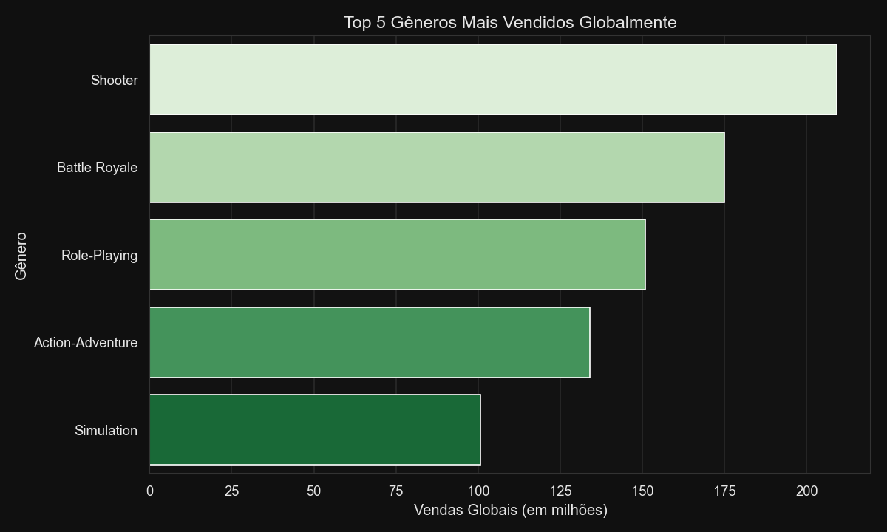
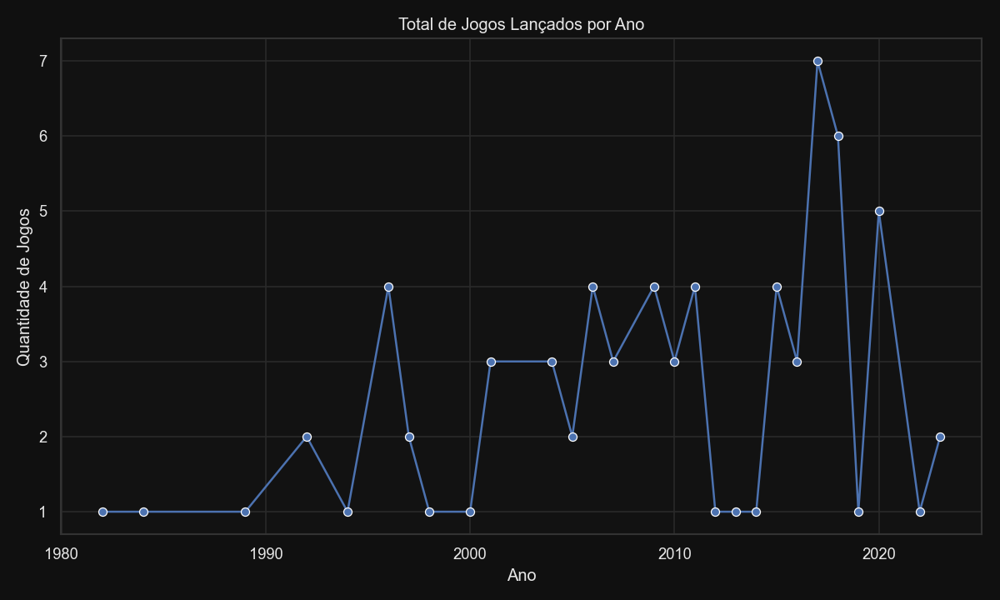

# 🎮 Case 1 – Análise Exploratória de Dados (Mercado de Games)

**Autora:** Raquel Joana da Silva  
**Linguagem:** Python (Pandas, Matplotlib, Seaborn)  
**Tema:** Análise de Vendas de Jogos e Tendências do Mercado

---

## 📘 Sobre o Projeto

Este projeto foi desenvolvido como parte do **Case 1 de Machine Learning**, com o objetivo de realizar uma **análise exploratória** de um conjunto de dados fictício de vendas globais de jogos (`vgsales.csv`).

A proposta é **entender as tendências do mercado de games** a partir dos dados disponíveis — identificando gêneros mais vendidos, plataformas mais populares e períodos de maior crescimento.

---

## ⚙️ Tecnologias Utilizadas
- Python 3  
- Pandas  
- Seaborn  
- Matplotlib  
- Jupyter / VS Code  

---

## 🧩 Etapas Realizadas

1. **Carregamento e Limpeza de Dados**  
   - Remoção de valores ausentes na coluna `Ano`  
   - Conversão de tipos e verificação da integridade do dataset  

2. **Análises Descritivas**  
   - Gênero mais vendido globalmente  
   - Plataforma com mais lançamentos  
   - Criação da coluna `Década` (Anos 90, 2000 e 2010)

3. **Visualizações**  
   - Gráfico de barras: *Top 5 Gêneros Mais Vendidos*  


   - Gráfico de linhas: *Lançamentos por Ano*



4. **Conclusão**  
   - Interpretação dos resultados e identificação das principais **tendências do mercado**.

---

## 📊 Principais Descobertas

- 🎮 **Gênero mais vendido:** *Shooter* (≈ 209 milhões de unidades)  
- 🕹️ **Plataforma com mais lançamentos:** *PC* (21 jogos)  
- 📈 **Pico de lançamentos:** entre **2005 e 2010**  

>A partir dos dados analisados,observei que essas tendências indicam que o setor de games é um setor maduro,competitivo e movido por avanços tecnológicos constantes,com forte influência do público que busca a conexão,desafio,sensação de imersão e evolução continua na área de jogos.

---

## 🖼️ Gráficos Gerados

**Top 5 Gêneros Mais Vendidos:**  


**Total de Jogos Lançados por Ano:**  


---

## 🧠 Conclusão Final

> A análise mostra que o mercado de games teve seu maior crescimento entre os anos **2000 e 2010**, impulsionado por títulos de ação e tiro (*Shooter*).  
> O **PC** manteve destaque pela quantidade de lançamentos, refletindo sua versatilidade e abertura para desenvolvedores.
> As tendências apontam para um mercado consolidado e competitivo, com foco em **experiências online, inovação e conectividade**.


## 🚀 Como Executar o Projeto

1. Clone o repositório:
   ```bash
   git clone https://github.com/SEU_USUARIO/Case1_analise_games.git
```

Acesse a pasta do projeto:

cd Case1_analise_games


(Opcional) Crie e ative o ambiente virtual:

python -m venv .venv
source .venv/bin/activate   # Linux ou macOS
.venv\Scripts\activate      # Windows


Instale as dependências:

pip install pandas matplotlib seaborn


Execute o script principal:

python analise_games.py


Os resultados serão gerados na pasta resultados/, incluindo:

grafico_generos_dark.png

grafico_lancamentos_dark.png

tabela_completa.html

✨ Desenvolvido por Raquel Joana da Silva
